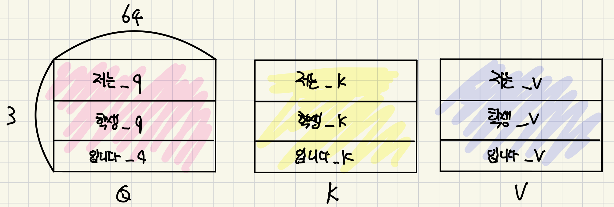
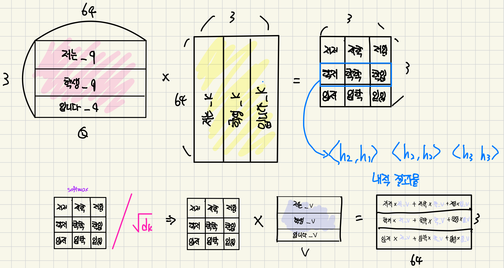
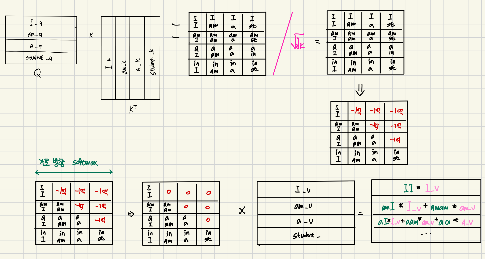
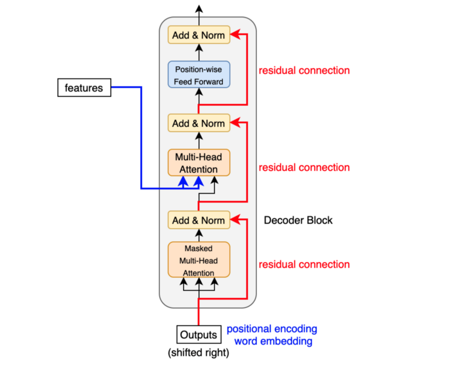

# Transformer

<p align="center">
  
</p>

## Attention is all you need (2017.06)

이 논문을 통해 자연어 처리 분야를 지배하게 되는 모델입니다. 
한국어에서 영어로의 번역을 잘하려면 어떻게 해야될까요? 입력 문장의 각 단어들을 숫자로 잘 바꿔야겠죠. 
`self-attention`을 이용해서 각 단어를 숫자로 **잘** 바꿨습니다. (의미를 잘 담았다.)
`self-attention`은 그냥 **내적** 입니다. **내적**은 닯은 정도를 의미하고, 여기서는 단어를 숫자로 바꾼 다음 내적해서 단어 간의 관계(닮음 정도)를 파악하자는 의도로 사용되었습니다. 
입력 문장도 출력 문장도 self-attention을 사용해서 숫자로 잘 바꿔 놓습니다.
또한 Attention을 통해 번역할 때 어떤 단어를 잘 봐야할지를 학습시켰습니다. CNN은 **conv**을 사용해서 이미지에서 어떤 특징을 추출할지를 학습시켰다면 트랜스포머는 **내적**을 사용해서 각 단어를 숫자로 바꿀 때 어떤 단어를 주목할지를 학습시켰습니다.  

## Positional Encoding

### InputEmbeddings

`nn.Embedding`(vocab_size, d_model)은 (vocab_size, d_model) 크기의 가중치 행렬을 생성합니다.

- 각 행은 하나의 토큰에 대한 d_model 차원의 임베딩 벡터입니다. : 행뽑기다

입력으로 정수 인덱스(0에서 vocab_size-1 사이의 값)가 주어지면, 해당 인덱스에 해당하는 행(벡터)을 반환합니다.


### PositionalEncoding

단어의 순서에 대한 정보를 주기위해서 단어의 위치를 one-hot (32x50xmax_len) 해서 `nn.Linear(max_len, 512)` 통과시키면 그게 위치 임베딩 벡터입니다.  예를 들어, 첫 번째 단어는 [1 0 0 0 ...] 두 번째 단어가 [0 1 0 0  ..] 세 번째 단어가 [0 0 1 0 ..] 이라면 얘네를 `nn.Linear`에 통과시키는 것이죠. 여기서 max_len은 가장 긴 문장의 단어 수 입니다. (넉넉하게 잡으면 됩니다. 예를 들어 100으로 잡을 경우) 
즉, `nn.Linear(100,512)`를 통과시키면 32x50x100 -> 32x50x512 가 됩니다. (실제 구현에서는 `nn.Embedding`사용.)
이제 둘을 더하면 (단어 임베딩 벡터 + 위치 임베딩 벡터) self-attention 할 준비가 된 것이죠. 

순서 정보가 왜 중요할까요? 
예를 들어 "아니 다 오르는데 왜 테슬라만 떨어져?" vs "아니 테슬라만 오르는데 왜 다 떨어져?" 

만약 위치 임베딩이 없었다면 '테슬라'가 어디에 있어도 '테슬라'라는 단어의 one-hot vector는 똑같기 때문에 똑같은 값으로 임베딩될 것입니다. 즉, 위치가 달라졌음에도 다른 의미인 것을 모른다는 것이죠. 
따라서 순서 정보를 알려주는 것이 중요합니다. 

> 하지만, 몇 번째 행에 해당 단어 임베딩 벡터가 있으므로 이미 순서 정보를 가지고 있는데 positional encoding을 왜 굳이 해야 하나요? 라는 질문이 있을 수도 있습니다. 

예를 들어 '저는'이 1행 '학생'이 2행 '입니다'가 3행에 있다고 하면 나중에 Weighted sum 할 때 섞입니다. '학생','저는','입니다' 이런식으로 말이죠.  

`nn.Linear(max_len,512)`를 통과시키는 방식은 말하자면 '테슬라(단어 임베딩 벡터)' + 다섯번째(위치 임베딩 벡터 <- 학습 파라미터) 와 같이 위치 정보를 아예 따로 학습시키자는 것입니다. 위치에 따라 어떤 벡터를 더해줄지 고민하기 귀찮으니 AI가 알아내도록 하는 것입니다. 

하지만 트랜스포머 논문에서는 위와 같은 방식으로 학습시키지는 않았고 위치별로 다른, 고정된 벡터를 사용합니다. 


> $pos$ 는 단어의 위치 , $i$는 0~255 

위의 수식처럼 sin과 cos값이 번갈아 나오는 특이한 형태입니다. 간단히 말하자면 그림에서 0번째 가로줄을 0 번째 단어의 임베딩 벡터에, 1번째 가로줄을 1번째 단어의 임베딩 벡터에 더해주는 것입니다. 


(개,단,차) -> (batch_size, seq_len, embedding_dim) 이므로

forward 함수에서 미리 계산된 positional encoding 행렬, 모든 배치, 현재 입력 시퀀스의 길이만큼 선택, 모든 임베딩 차원을 선택합니다. ` requires_grad_(False) `이 부분은 선택된 positional encoding에 대해 그래디언트 계산을 비활성화 합니다. 이건 학습되는 파라미터가 아니므로 백프로파게이션동안 이 부분의 그레디언트를 계산할 필요가 없습니다. 

### Layer Normalization


Transformer 모델에서 Layer Normalization을 사용하는 이유는 여러가지가 있습니다. 예를 들어, 학습 안정성 향상과 수렴 속도 개선 등이 일반적인 이유입니다. 

Transformer에서는 Attention Mechanism과의 호환성도 큰 이유입니다. 
Attention은 다양한 길이의 입력을 처리합니다. 하지만 입력값의 길이는 문장마다 다르기 때문에 Layer Normalization의 입력 길이에 상관없이 제공하는 일관된 정규화는 Batch Normalization보다 적합합니다.


평균 (μ) 계산: $\mu = \frac{1}{H} \sum_{i=1}^H x_i$

분산 (σ²) 계산: $\sigma^2 = \frac{1}{H} \sum_{i=1}^H (x_i - \mu)^2$

정규화: $y = \gamma \odot \frac{x - \mu}{\sqrt{\sigma^2 + \epsilon}} + \beta$

$x$ : 입력 벡터
$H$ : 입력 벡터의 차원 (hidden size 또는 d_model)
$\epsilon$ : 수치 안정성을 위한 작은 값
$\gamma$ : 스케일 파라미터 (코드의 alpha에 해당)
$\beta$ : 이동 파라미터 (코드의 bias에 해당)
$\odot$ : 요소별 곱셈 (element-wise multiplication)


> Code 구현할 때 궁금했던 점 : alpha와 Bias의 초기화 방식의 차이점. alpha는 `torch.ones`를 사용하고 bias는 `torch.zeros`를 사용?

사실 큰 의미는 없는데...
alpha를 1로 초기화하는 것은 **항등 변환(identity transformation)** 을 하는 것과 같습니다. 입력값을 크게 변환하지 않도록 설정하는 것이죠. 그리고 `nn.Parameter()`로 설정이 되어 있어서 점진적으로 모델이 천천히 스케일을 조정하도록 허용합니다. 또한 bias를 0으로 초기화하는 이유는 정규화된 입력의 평균을 0으로 유지하는 것입니다. 그리고 불필요한 초기 편향을 방지하는 것이죠. 


``` python
self.alpha = nn.Parameter(torch.ones(1)) # Multiplied
self.bias = nn.Parameter(torch.zeros(1)) # Added 
```
---


# Feed Forward

Feed Forward는 $FFN(x) = max(0,xW_1 + b_1)W_2 + b_2$ 로 정의됩니다. 

첫 번째 선형 변환인 $xW_1 + b_1$ 을 `nn.Linear`를 통해 구현해야 합니다.

우선 `nn.Linear(in_features, out_features)` 는 $y = xW^T + b$ 연산을 수행합니다.

입력에 가중치 행렬을 곱하고 편향을 더하는 연산을 수행하는 것이죠. 
`nn.Linear()`가 수식의 행렬 곱셈과 편향 덧셈을 모두 자동적으로 처리하기 때문에 코드가 수식보다 더 간단해 보입니다. 사실상 차원만 계산하면 되는 것이죠. 아래의 수식은 `nn.Linear()`가 실제로 내부에서 동작하는 연산입니다. '@'는 행렬의 곱셈을 나타냅니다. 

```
output = input @ weight.T + bias
```


forward() 함수를 기준으로 저 수식과 코드가 어떻게 매칭되는지 자세히 봐야합니다.

우선 'FeedForwardBlock' 클래스에서 받아오는 매개변수는 `d_model` 과 `d_ff`,'dropout' 입니다.
`d_model`은 앞에서 계속 사용한 것과 동일하게 모델의 기본 차원이고 논문에서 512로 고정하고 있습니다. 
`d_ff`는 Feed-Forward Network의 내부(hidden)차원이고 중간 층의 뉴런 수입니다. 
논문에서 `d_ff`의 크기는 2048로 설정하고 보통 `d_model`의 4배 정도로 설정합니다. 

> BERT에서 d_model은 768 , d_ff는 3072로 설정했고 GPT-2 모델도 동일합니다.

첫 번째 선형 변환은 `self.linear_1` 으로 정의되어 있습니다. 
$FFN(x)$ 수식에서 $xW_1 + b_1$ 부분에 해당합니다. 

```python
self.linear_1 = nn.Linear(d_model, d_ff)
```

두 번째 선형 변환은 `self.linear_2` 로 정의되어 있으며 확장된 차원 `d_ff`에서 원래의 `d_model` 차원으로 축소합니다. $FFN(x)$ 수식에서 $(...)W_2+b_2$ 부분에 해당합니다. 

```python
self.linear_2 = nn.Linear(d_ff, d_model)
```

그래서 forward() 함수의 마지막 return 값을 보면 아래와 같이 정의되어 있습니다.
$max(0,xW_1+b_1)$ 부분은 `torch.relu()`로 처리합니다.

```python
self.linear_2(self.dropout(torch.relu(self.linear_1(x))))
```

---

# Multi-Head Attention 

## Abstract


트랜스포머가 학습하는 layer에 대해서 알아보겠습니다. 입력 문장 내에서 단어 간의 관계를 학습시키기 위해 **내적**을 사용한다고 했죠. 그런데, 어떤 단어와 단어가 관계가 깊은지 즉, 어떤 단어를 주목해야 할지를 AI가 학습해서 알아내야 할텐데 내적은 파라미터가 필요한 연산이 아닙니다. 

우리는 내적할 단어 임베딩 벡터를 **선형 변환**하는 **FC layer**를 앞에 놓고 얘를 학습시키는 것입니다. 
여기서 FC layer는 뭘 하는거죠? FC layer를 하나 통과한다는 것은 어떤 연산을 해주는다는 것일까요.
FC layer는 weight matrix 곱하고 bias vector를 더하는 것이죠. 
matrix를 곱한다는 것은 선형 변환을 의미하는 것입니다. 그래서 행렬이 학습된다는 것은 선형 변환을 어떻게 할까를 학습한다는 것과 일맥상통합니다.  

<figure>
  
  <figcaption style="text-align: center;">figure1</figcaption>
</figure>

> 각 Linear 층은 가중치 행렬 W와 편향 b를 포함합니다. 입력 x에 대해서 각 변환은 $xW^T + b$ 연산을 수행합니다. 이 변환들은 입력을 각각 Query, Key, Value 공간으로 투영합니다. 
이 변환들은 각 어텐션 헤드에 대해 공유됩니다. 실제로는 이 변환 후에 결과를 여러 헤드로 분할합니다.(head=8). 

`Multi-Head Attention` 클래스를 들어가면 가장 먼저 만나게 되는 것이 저 `nn.Linear`입니다.
First stage에서 만든 32x50x512를 (*편의상 1x3x512(저는 학생 입니다)로 설정.*)

`fc_q = nn.Linear(512,64)` 여기도
`fc_k = nn.Linear(512,64)` 여기도
`fc_v = nn.Linear(512,64)` 여기도

통과시켜서 Q,K,V를 얻습니다. 그림에서는 통과시키기 전에도 QKV로 표기합니다. 
앞서 단어 임베딩과 위치 임베딩을 더한 상태에서 Linear를 **병렬적으로** 세 번 통과시킵니다. 

위에서 예시로 설정한 1x3x512를 `nn.Linear(512,64)`에 통과시키면 '1x3x512 -> 1x3x64' 이렇게 됩니다. 아주 중요한 개념들이 등장하죠. 

- Query는 관계를 물어보는 기준 단어 벡터가 됩니다. (질문을 잘하자)
- Key는 Query와 관계를 알아볼 단어 벡터가 됩니다. (답변을 잘하자)
- Value는 위 단어의 의미를 담은 벡터가 됩니다.  (표현을 잘하자)





*We suspect that for large values of d_k, the dot products grow large in magnitude, pushing the softmax function into regions where it has extremely small gradients*

'$d_k$의 값이 클 경우, 내적의 크기가 커져서 Softmax 함수를 극도로 작은 기울기를 가진 영역으로 밀어낼 수 있다고 생각합니다.'


$$Attention(Q,K,V) = softmax(\frac{QK^T}{\sqrt{d_k}})V$$ 


$\sqrt{d_k}$ 는 key의 dimension에 루트를 씌운 건데요, 위의 예시에서는 $\sqrt{64}$ 죠?
$d_k$가 클수록 내적의 분산이 자꾸 커져서 $\sqrt{d_k}$로 나눠 줌으로써 softmax 미분이 작아지는 것을 방지하는 것입니다. $d_k$가 512라고 하면 내적할 때 분산이 커질 수 밖에 없습니다. 길이가 길면 내적 결과의 분산이 커지는 것을 방지하는 것이죠. softmax를 통과하기 전의 분산이 크면 미분값이 작아집니다. 

그 다음 V를 곱해주고 결과를 얻을 수 있습니다.



여기서 마지막 결과물의 의미를 잘 생각해봅시다.
앞서 봤던 QKV에 `nn.Linear(512,64)` 를 통과하고 위의 그림에서 처럼 연산하는 행위를 한 번 한거예요.(figure1의 잔상)
이 행위를 총 8번 해줘야합니다. 이게 바로 `Multi-Head Attention` 입니다.

`fc_q1 = nn.Linear(512,64)` , `fc_q2 = nn.Linear(512,64)` , `fc_q3 = nn.Linear(512,64)` ... `fc_q8 = nn.Linear(512,64)`
`fc_k1 = nn.Linear(512,64)`, `fc_k2 = nn.Linear(512,64)` ,`fc_k3 = nn.Linear(512,64)` ... `fc_k8 = nn.Linear(512,64)`
`fc_v1 = nn.Linear(512,64)` , `fc_v2 = nn.Linear(512,64)` , `fc_v3 = nn.Linear(512,64)` ... `fc_v8 = nn.Linear(512,64)` 

마치 conv 필터 여러개를 사용 하여 여러개 특징 맵을 얻는 것과 비슷합니다. 이렇게 해서 얻는 효과는 무엇일까요? 이제 1x3x64 짜리 8개를 가로로 concat 해주어 1x3x512를 얻을 수 있습니다.
맨 위에 `nn.Linear(512,512)`를 통과하여 도로 1x3x512로 만들어줍니다. (입력과 같은 사이즈)

---

Maksed MHA는 현재 단어 포함 이전 단어들만 참조하는 방법입니다. 

Decoder에서는 똑같은 MHA 모듈을 사용하는데 Q 로는 해당 Decoder layer에서 얻은 임베딩 벡터를, KV로는 마지막 Encoder layer의 출력 임베딩 벡터를 사용합니다. 이렇게 하면 다음 단어가 어떤 단어가 출력이 되야하는지를 출력 문장의 Q로 물어보고 입력 문장의 KV를 보고 알아내는 것이죠. 그런데 이 Q는 MHA를 이미 통과했으니 출력 문장의 각 단어에 대한 의미를 잘 담은 Q라고 할 수 있습니다. 그렇게 context vector를 완성하고 [ADD&NORM]을 통과하는 것이죠. 그리고 같은 구조의 Feed Forward를 통과합니다. 




마지막 단계에서는 `Decoder`의 마지막 레이어 출력을 사용합니다. `nn.Linear(512,5972)`를 통과시키면 끝납니다. softmax 통과 시키고 cross-entropy로 Loss를 정의합니다. 
추론 시에는 가장 높은 확률의 단어를 뱉어내는 것입니다. 


## Code review

$head_i = Attention(QW_i^Q, KW_i^K, VW_i^V)$

$Multihead(Q,K,V) = Concat(head_i, ... head_h)W^O$

Query, Key, Value를 생성하는 선형 변환을 정의합니다.
입력을 Query,Key,Value 벡터로 변환하는 과정입니다. 


이 선형 변환들을 통해 입력 데이터를 어텐션 메커니즘에 적합한 형태로 변환합니다. 
각 변환은 입력의 다른 측면을 강조하거나 추출하여, 어텐션 계산에 사용될 준비를 합니다. 

```python
class MultiHeadAttention(nn.Module):

    def __init__(self, d_model:int, h: int, dropout: float) -> None: 
        super().__init__()
        self.d_model = d_model 
        self.h = h 
        assert d_model % h ==0 , "d_model is not divisible by h"

        self.d_k = d_model // h
        self.w_q = nn.Linear(d_model, d_model) # Wq
        self.w_k = nn.Linear(d_model, d_model) # Wk
        self.w_v = nn.Linear(d_model, d_model) # Wv 

        self.w_o = nn.Linear(d_model, d_model) # wo
        self.dropout = nn.Dropout(dropout)  
```

`attention` 정적 메서드(staticmethod)는 점곱(Scaled Dot-Product Attention)을 구현합니다. 
`@staticmethod` 데코레이터는 메서드를 정적 메서드로 정의하고 클래스의 인스턴스 없이 직접 호출할 수 있도록 합니다. 

$$Attention(Q,K,V) = softmax(\frac{QK^T}{\sqrt{d_k}})V$$

위 수식을 통해 어텐션 스코어를 계산할 수 있습니다. 
`query @ key.transpose(-2,-1)`를 통해 행렬 곱 연산을 합니다. 위의 수식에서 $QK^T$ 에 해당하는 부분이죠. 
`math.sqrt(d_k)`는 $\sqrt{d_k}$ 에 해당하는 부분입니다.

따라서 $\sqrt{d_k}$ 이렇게 스케일링을 해주면 내적의 분산을 1로 정규화할 수 있습니다. 
요약하자면, 수치적 안정성을 위해서 스케일링을 해주는 것입니다. 큰 차원에서 내적 값이 지나치게 커지는 것을 방지하고, softmax 함수가 적절한 범위에서 작동하도록 보장합니다. 이를 통해 모델의 학습 과정이 더 안정적이고 효과적으로 이루어질 수 있습니다.  

마지막에 return 되는 값은 `attention_scores @ value` 와 `attention_scores`입니다. 

`attention_scores @ value`는 각 위치에 대해서 모든 다른 위치의 value들의 가중 합을 나타냅니다.
이 결과를 통해서 각 위치가 시퀀스의 다른 부분들로부터 어떤 정보를 잘 **주목**했는지를 반영합니다.

`attention_scores`는 Query와 Key 쌍의 관계를 어떻게 평가했는지를 보여줍니다. 
점수가 높을수록 강한 관계를 나타내고 낮은 점수는 약한 관계를 나타냅니다.

두 값을 함께 반환함으로써 어텐션의 결과를 얻을 수 있고 어텐션 과정 자체를 분석할 수 있습니다.
추후 `attention_scores`를 시각화하여 모델이 입력의 어느 부분에 집중했는지를 시각화하는 데 사용할 수 있습니다. 


```python
@staticmethod # 클래스의 인스턴스 생성 없이 바로 접근 가능
    def attention(query, key, value, mask, dropout: nn.Dropout):
        d_k = query.shape[-1]
        # (Batch, h, Seq_Len, d_k) --> (Batch, h, Seq_Len, Seq_Len) 
        attention_scores = (query @ key.transpose(-2, -1)) / math.sqrt(d_k) # (Batch, h, seq_len, d_k) x (Batch, h, d_k, seq_len) = (Batch, h, seq_len, seq_len)
        if mask is not None:
            attention_scores.masked_fill(mask == 0, -1e9) # mask가 0인 부분에 -1e9를 넣어줌
        attention_scores = attention_scores.softmax(dim=-1) # (Batch, h, seq_len, seq_len)
        if dropout is not None:
            attention_scores = dropout(attention_scores)
        return (attention_scores @ value), attention_scores 
```

`Multi-Head Attention`의 전체 과정을 구현한 코드입니다. 
`view()`와 `transpose()`의 동작 과정을 명확하게 이해하셔야 합니다. 
`code.md` 파일에 해당 내용을 정리했으니 그 부분을 확인하시면 됩니다.

(개,단,차)로 이루어져 있는데 여기에 view()를 적용합니다. 
`query = query.view(query.shape[0], query.sahpe[1], self.h, self.d_k).transpose(1,2)` 이렇게 적용하고 있죠? 

`query.shape[0]`은 (개,단,차)에서 첫 번째 '개'는 Batch를 의미하므로 Batch의 크기가 됩니다.
`query.shape[1]`은 (개,단,차)에서 두 번째 '단'은 단어의 길이니까 Seq_len의 길이가 되는 것이죠.

view()는 형상만 바꾸어주는 것이므로 중간에 `h`라는 헤드의 개수를 껴주는 것이죠. 그리고 각 헤드의 차원도 넣어줍니다. 결과적으로 (Batch, Seq_len, d_model) 이런 형상을 (Batch, seq_len, h, d_k) 이렇게 바꿔주는 것입니다.

`transpose(1,2)`를 통해서 첫 번째와 두 번째 차원을 교환합니다. 그렇게 하면 (Batch, h, seq_len, d_k) 이런 형태가 됩니다. 

이런 과정을 거치는 이유는 `d_model`의 차원을 `h`개의 `d_k` 차원으로 분할하기 위해서죠. 다중 헤드를 분리하는 것입니다. 그리고 각 헤드의 차원을 앞으로 가져와서 각 헤드가 독립적으로 어텐션을 계산할 수 있도록 해주는 것이죠. 

```python
def forward(self, q, k, v, mask = None):
        query = self.w_q(q) #(Batch, Seq_len, d_model) --> (Batch, Seq_len, d_model)
        key = self.w_k(k)   #(Batch, Seq_len, d_model) --> (Batch, Seq_len, d_model)
        value = self.w_v(v) #(Batch, Seq_len, d_model) --> (Batch, Seq_len, d_model)

        # (Batch, seq_len, d_model) -> ( Batch, seq_len, h, d_k) -> (Batch, h, seq_len, d_k)    
        query = query.view(query.shape[0], query.sahpe[1], self.h, self.d_k).transpose(1,2)
        key = query.view(key.shape[0], key.sahpe[1], self.h, self.d_k).transpose(1,2)
        value = value.view(value.shape[0], value.sahpe[1], self.h, self.d_k).transpose(1,2) 
        
        x, self.attention_scores = MultiHeadAttention.attention(query, key, value, mask, self.dropout)

        # (Batch, h, Seq_Len, d_k) --> (Batch, Seq_Len, h, d_k) --> (Batch, Seq_Len, d_model)
        x = x.transpose(1,2).contiguous().view(x.shape[0], -1, self.h * self.d_k)

        # (Batch, Seq_Len, d_model) --> (Batch, Seq_Len, d_model)   
        return self.w_o(x)
```

### MHA를 다른 방법으로 구현해보자

`Multi-Head Attention (MHA)` 메커니즘을 구현한 다른 버전입니다.

앞서 구현한 방법과 큰 차이는 `view()`나 `transpose()`를 사용하지 않고 `rearrange()`를 사용했다는 점이죠. 

이전 구현에서는 PyTorch의 기본 함수인 `view()`와 `transpose()`를 사용하여 텐서의 형상을 변경했습니다. 반면, 이 새로운 구현에서는 `einops` 라이브러리의 `rearrange()`함수를 사용합니다. `rearrange()` 함수는 더 직관적이고 읽기 쉬운 방식으로 텐서 조작을 표현할 수 있게 해줍니다. 예를 들어, `batch seq (h head) -> batch h seq head`와 같은 패턴을 사용하여 텐서의 재배열을 명확하게 지정할 수 있습니다.

그리고 마스킹 적용 방식에 차이가 있습니다. 이전 구현에서는 `masked_fill()` 메서드를 사용했지만, 새 구현에서는 직접 인덱싱을 통해 마스크를 적용합니다. 두 방식 모두 유효하지만, 새 방식이 약간 더 간결합니다.

종합적으로, 새로운 구현은 더 현대적이고 가독성이 높은 접근 방식을 채택하고 있으며, 특히 복잡한 텐서 조작을 다루는 데 있어 더 효과적입니다. 이는 코드의 유지보수성과 확장성을 향상시키는 데 도움이 될 수 있습니다.

```python
class MHA(nn.Module):
    def __init__(self, d_model, n_heads):
        super().__init__()

        self.n_heads = n_heads

        self.fc_q = nn.Linear(d_model, d_model) # 차 or 개x차 or 개x개x차 로 입력해줘야
        self.fc_k = nn.Linear(d_model, d_model)
        self.fc_v = nn.Linear(d_model, d_model)
        self.fc_o = nn.Linear(d_model, d_model)

        self.scale = torch.sqrt(torch.tensor(d_model / n_heads))

    def forward(self, Q, K, V, mask = None):

        Q = self.fc_q(Q) # 개단차
        K = self.fc_k(K)
        V = self.fc_v(V)

        Q = rearrange(Q, '개 단 (헤 차) -> 개 헤 단 차', 헤 = self.n_heads) # 개단차 -> 개헤단차
        K = rearrange(K, '개 단 (헤 차) -> 개 헤 단 차', 헤 = self.n_heads)
        V = rearrange(V, '개 단 (헤 차) -> 개 헤 단 차', 헤 = self.n_heads)

        attention_score = Q @ K.transpose(-2,-1)/self.scale # 개헤단단

        if mask is not None:
            attention_score[mask] = -1e10
        attention_weights = torch.softmax(attention_score, dim=-1) # 개헤단단

        attention = attention_weights @ V # 개헤단차

        x = rearrange(attention, '개 헤 단 차 -> 개 단 (헤 차)') # 개헤단차 -> 개단차
        x = self.fc_o(x) # 개단차

        return x, attention_weights
```

---

# Encoder


`EncoderBlock` 클래스는 인코더의 단일 블록을 나타냅니다. 
위 구조를 확인해보면 앞서 구현한 `Multi-Head Attention` 블록과 `Feed Forward` 블록, 그리고 두 개의 `residual connection`이 연결되어 있습니다. `inputs` 에서 `Multi-Head Attention`로 들어가는 세 개의 화살표는 각 Query, Key, Value 입니다. 


본 논문에서 `Encoder`는 6개의 동일한 층으로 구성된다고 설명합니다. 여기서 말하는 6개의 층은 `EncoderBlock`을 의미합니다. 따라서 'EncoderBlock'은 하나의 "층"을 나타내는 것이죠. 
그리고 아래의 `Encoder` 클래스는 6개의 동일한 `EncoderBlock`으로 구성됩니다. 언급된 `sublayer`는 각 `EncoderBlock`에 포함된 `self-attention sublayer`와 `feed-forward sublayer`를 의미합니다.

인코더 구조를 나타내는 그림과 논문을 보면 각 서브층(self-attention과 feed-forward) 주변에 `residual connection`을 사용하는 것을 확인할 수 있습니다. 이는 `LayerNorm(x + Sublayer(x))`의 형태로 구현됩니다.

```python
class ResidualConnection(nn.Module):
    def __init__(self, dropout: float) -> None :
        super().__init__()
        self.dropout = nn.Dropout(dropout)  
        self.norm = LayerNormalization()

    def forward(self, x, sublayer):
        return x + self.dropout(sublayer(self.norm(x)))
```

`x = self.residual_connections[0](x, lambda x: self.self_attention_block(x, x, x, src_mask))`
이 코드는 `Multi-Head Attention`을 수행합니다. `x`가 세 번 들어가는 이유는 self-attention에서 Query, Key, Value가 모두 같은 입력(x)에서 나오기 때문이죠? 이 부분을 `lambda` 함수를 사용해서 `residual_connection`에 전달합니다. 그러면 `residual_connection`에서 `x`는 원본 입력값을 받고 `sublayer`에는 `lambda`가 적용된 'Multi-Head Attention`의 출력값을 받겠죠? 

`x = self.residual_connections[1](x, self.feed_forward_block)`
self-attention을 통과한 결과를 `feed_forawrd` 네트워크에 통과시킵니다. 마찬가지로 `residual_connection`을 적용합니다.   

```python
class EncoderBlock(nn.Module):
    def __init__(self, self_attention_block: MultiHeadAttention, feed_forward_block: FeedForwardBlock, dropout: float) -> None:
        super().__init__()
        self.self_attention_block = self_attention_block
        self.feed_forward_block = feed_forward_block    
        self.residual_connections = nn.ModuleList([ResidualConnection(dropout) for _ in range(2)])

    def forward(self, x, src_mask): 
        x = self.residual_connections[0](x, lambda x: self.self_attention_block(x, x, x, src_mask))
        x = self.residual_connections[1](x, self.feed_forward_block)

        return x 
```

`layers`는 이미 여러 `EncoderBlock`들을 포함하고 있는 `nn.ModuleList`입니다. 이 리스트는 `Encoder` 클래스 외부에서 생성되어 전달됩니다. 

```python
class Encoder(nn.Module):
    def __init__(self, layers: nn.ModuleList) -> None:
        super().__init__()
        self.layers = layers
        self.norm = LayerNormalization()

    def forward(self, x, src_mask):
        for layer in self.layers:
            x = layer(x, src_mask)
        return self.norm(x) 
```

### Encoder의 동작 과정 정리 

입력값인 `x`가 `ResidualConnection[0]`으로 들어갑니다. 

`ResidualConnection[0]`의 내부 :
    1. `self.norm(x)`: 원본 `x`에 `Layer Normalization`을 적용합니다.
    2. `sublayer(self.norm(x))`: 정규화된 `x`를 `MHA (Multi-Head Attention)`에 통과시킵니다.
    3. `self.dropout(...)`: `MHA`의 출력에 dropout을 적용합니다. 
    4. 원래의 `x`와 처리된 결과가 더해집니다. (`ResidualConnection`)

따라서 원본 `x` 값이 보존되어 더해지는 것이 residual connection의 핵심이고 `MHA`를 거친 `x` 값이 원본 `x`에 더해집니다. 

> Transformer 모델이 깊은 구조에서도 효과적으로 학습할 수 있게 하는 핵심 요소

---

# Decoder 




`Encoder`의 구조와 다르게 `Decoder`에는 세 개의 block이 있습니다.(Self-attention, Cross-attention, Feed-forward)

`x = self.residual_connections[0](x, lambda x: self.self_attention_block(x, x, x, tgt_mask))`


첫 번째 `Multi-Head Attention` 블록은 논문에서 `masked multi-head attention` 이라고 합니다. `Decoder`에서는 현재 위치의 토큰이 미래의 토큰 정보를 참조하지 못하게 해야합니다. 이는 학습할 때 미래의 단어를 미리 보는 것을 방지하는 '치팅'을 방지하고 추론 시 auto-regressive한 생성을 가능하게 합니다. 

`tgt_mask`는 일반적으로 상삼각행렬 형태의 마스크입니다. 현재 위치보다 이후에 해당하는 부분을 매우 작은 값(예: -inf)으로 설정합니다. 

`self_attention_block` 내부에서 `attention scores`를 계산할 때 `tgt_mask`가 적용됩니다. 마스크된 위치의 `attention score`가 매우 작아지므로 `softmax` 후에는 실질적으로 0이 됩니다. 결과적으로 현재 토큰은 자신과 이전 토큰들만을 참조하게 됩니다.


`x = self.residual_connections[1](x, lambda x: self.src_attention_block(x, encoder_output, encoder_output, src_mask))`

두 번째 `Cross attention`으로 정의된 부분은 `Encoder`의 출력과 `Decoder`의 현재 상태를 연결하는 역할을 합니다. 그림을 보면 더 정확하게 알 수 있는데요, Query는 `Decoder`의 현재 상태인 `x`를 의미합니다. Key와 Value는 `Encoder`의 출력입니다. `src_mask`는 인코더 입력의 패딩을 마스킹하는 데 사용됩니다.  

정리하자면
`Encoder`와 `Decoder`는 똑같은 `Multi-Head Attention`을 사용하는데 Query로는 해당 `Decoder Layer`에서 얻은 임베딩 벡터를, Key Value 로는 마지막 `Econder Layer`의 출력 임베딩 벡터를 사용합니다. 이렇게 하면 다음 단어가 어떤 것이 출력 되야할지를 출력 문장의 Query로 물어보고 입력 문장의 Key Value를 보고 알아낼 수 있는 것이죠. 그런데 이 Query는 `Multi-Head Attention`을 통과한 놈이니까 출력 문장의 각 단어에 대한 의미를 잘 담은 Query라는 것이죠. 그렇게 `context vector`를 완성하고 그림의 `Add&Norm`을 통과합니다. 

`x = self.residual_connections[2](x, self.feed_forward_block)`

마지막 라인은 이전과 동일하게 추가적인 비선형 변환을 적용하는 것이죠.

```python
class DecoderBlock(nn.Module):

    def __init__(self, self_attention_block: MultiHeadAttention, cross_attention_block: MultiHeadAttention, feed_forward_block: FeedForwardBlock, dropout: float) -> None:
        super().__init__()
        self.self_attention_block = self_attention_block
        self.src_attention_block = src_attention_block
        self.feed_forward_block = feed_forward_block
        self.residual_connections = nn.Module([ResidualConnection(dropout) for _ in range(3)])   

    def forward(self, x, encoder_output, src_mask, tgt_mask):
        x = self.residual_connections[0](x, lambda x: self.self_attention_block(x, x, x, tgt_mask)) 
        x = self.residual_connections[1](x, lambda x: self.src_attention_block(x, encoder_output, encoder_output, src_mask))
        x = self.residual_connections[2](x, self.feed_forward_block)
        return x
```

이 구조는 Transformer 모델의 디코더 부분을 효과적으로 구현합니다. 각 `DecoderBlock이` `self-attention`, `cross-attention`, 그리고 `feed-forward` 네트워크를 포함하고 있으며, 이들이 여러 층으로 쌓여 복잡한 시퀀스 생성 작업을 수행할 수 있게 합니다.
`Encoder`와의 주요 차이점은 디코더가 `encoder_output`을 입력으로 받아 `cross-attention`을 수행한다는 점과, `tgt_mask`를 사용하여 자기회귀적(autoregressive) 생성을 가능하게 한다는 점입니다.


```python
class Decoder(nn.Module):

    def __init__(self, layers: nn.ModuleList) -> None:
        super().__init__()
        self.layers = layers
        self.norm = LayerNormalization()

    def forward(self, x, encoder_output, src_mask, tgt_mask):
        for layer in self.layers:
            x = layer(x, encoder_output, src_mask, tgt_mask)
        return self.norm(x)
```

---

## Transofrmer


```python
class Transformer(nn.Module):

    def __init__(self, encoder: Encoder, decoder: Decoder , src_embed: InputEmbeddings, tgt_embed: InputEmbeddings, src_pos: PositionalEncoding, tgt_pos: PositionalEncoding, projection_layer: ProjectionLayer) -> None:
        super().__init__()
        self.encoder = encoder
        self.decoder = decoder
        self.src_embed = src_embed
        self.tgt_embed = tgt_embed
        self.src_pos = src_pos
        self.tgt_pos = tgt_pos
        self.projection_layer = projection_layer

    def encode(self, src, src_mask):
        src = self.src_embed(src)
        src = self.src_pos(src)
        return self.encoder(src, src_mask)

    def decode(self, encoder_output, src_mask, tgt, tgt_mask):
        tgt = self.tgt_embed(tgt)
        tgt = self.tgt_pos(tgt)
        return self.decoder(tgt, encoder_output, src_mask, tgt_mask)    

    def project(self,x):
        return self.projection_layer(x)

def build_transformer(src_vocab_size: int, tgt_vocab_size: int, src_seq_len: int, tgt_seq_len: int, d_model: int =512, N: int =6, h: int =8, dropout: float = 0.1,  d_ff: int = 2048) -> Transformer:
    # Create the embedding layers
    src_embed = InputEmbeddings(d_model, src_vocab_size)
    tgt_embed = InputEmbeddings(d_model, tgt_vocab_size)

    # Create the positional encoding layers 
    src_pos = PositionalEncoding(d_model, src_seq_len, dropout)
    tgt_pos = PositionalEncoding(d_model, tgt_seq_len, dropout)

    # Create the encoder blocks
    encoder_blocks = []
    for _ in range(N):
        encoder_self_attention_block = MultiHeadAttention(d_model, h, dropout)
        feed_forward_block = FeedForwardBlock(d_model, d_ff, dropout)
        encoder_block = EncoderBlock(encoder_self_attention_block, feed_forward_block, dropout)
        encoder_blocks.append(encoder_block)

        # create the decoder blocks 
    decoder_blocks = [] 
    for _ in range(n):
        decoder_self_attention_block = MultiHeadAttention(d_model, h, dropout)      
        decoder_cross_attention_block = MultiHeadAttention(d_model, h, dropout)
        feed_forward_block = FeedForwardBlock(d_model, d_ff, dropout)   
        decoder_block = DecoderBlock(decoder_self_attention_block, decoder_cross_attention_block,feed_forward_block, dropout)
        decoder_blocks.append(decoder_block)

    encoder = Encoder(nn.ModuleList(encoder_blocks))
    decoder = Decoder(nn.ModuleList(decoder_blocks))

    projection_layer = ProjectionLayer(d_model, tgt_vocab_size)

    transformer = Transformer(encoder, decoder, src_embed, tgt_embed, src_pos, tgt_pos, projection_layer)

    # Initialize the parameters with Glorot initialization
    for p in transformer.parameters():
        if p.dim() > 1:
            nn.init.xavier_uniform_(p)

    return transformer
```