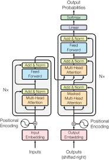

# Transformer

<p align="center">
  
</p>

## Positional Encoding

### InputEmbeddings

`nn.Embedding`(vocab_size, d_model)은 (vocab_size, d_model) 크기의 가중치 행렬을 생성합니다.

- 각 행은 하나의 토큰에 대한 d_model 차원의 임베딩 벡터입니다. : 행뽑기다

입력으로 정수 인덱스(0에서 vocab_size-1 사이의 값)가 주어지면, 해당 인덱스에 해당하는 행(벡터)을 반환합니다.


### PositionalEncoding

(개,단,차) -> (batch_size, seq_len, embedding_dim) 이므로

forward 함수에서 미리 계산된 positional encoding 행렬, 모든 배치, 현재 입력 시퀀스의 길이만큼 선택, 모든 임베딩 차원을 선택합니다. 

requires_grad_(False) 이 부분은 선택된 positional encoding에 대해 그래디언트 계산을 비활성화 합니다. 이건 학습되는 파라미터가 아니므로 백프로파게이션동안 이 부분의 그레디언트를 계산할 필요가 없습니다. 

### Layer Normalization


Transformer 모델에서 Layer Normalization을 사용하는 이유는 여러가지가 있습니다. 예를 들어, 학습 안정성 향상과 수렴 속도 개선 등이 일반적인 이유입니다. 

Transformer에서는 Attention Mechanism과의 호환성도 큰 이유입니다. 
Attention은 다양한 길이의 입력을 처리합니다. 하지만 입력값의 길이는 문장마다 다르기 때문에 Layer Normalization의 입력 길이에 상관없이 제공하는 일관된 정규화는 Batch Normalization보다 적합합니다.


평균 (μ) 계산: $\mu = \frac{1}{H} \sum_{i=1}^H x_i$

분산 (σ²) 계산: $\sigma^2 = \frac{1}{H} \sum_{i=1}^H (x_i - \mu)^2$

정규화: $y = \gamma \odot \frac{x - \mu}{\sqrt{\sigma^2 + \epsilon}} + \beta$

$x$ : 입력 벡터
$H$ : 입력 벡터의 차원 (hidden size 또는 d_model)
$\epsilon$ : 수치 안정성을 위한 작은 값
$\gamma$ : 스케일 파라미터 (코드의 alpha에 해당)
$\beta$ : 이동 파라미터 (코드의 bias에 해당)
$\odot$ : 요소별 곱셈 (element-wise multiplication)


> Code 구현할 때 궁금했던 점 : alpha와 Bias의 초기화 방식의 차이점. alpha는 `torch.ones`를 사용하고 bias는 'torch.zeros'를 사용?

사실 큰 의미는 없는데...
alpha를 1로 초기화하는 것은 항등 변환(identity transformation)을 하는 것과 같습니다. 입력값을 크게 변환하지 않도록 설정하는 것이죠. 그리고 `nn.Parameter()`로 설정이 되어 있어서 점진적으로 모델이 천천히 스케일을 조정하도록 허용합니다. 또한 bias를 0으로 초기화하는 이유는 정규화된 입력의 평균을 0으로 유지하는 것입니다. 그리고 불필요한 초기 편향을 방지하는 것이죠. 


``` python
self.alpha = nn.Parameter(torch.ones(1)) # Multiplied
self.bias = nn.Parameter(torch.zeros(1)) # Added 
```