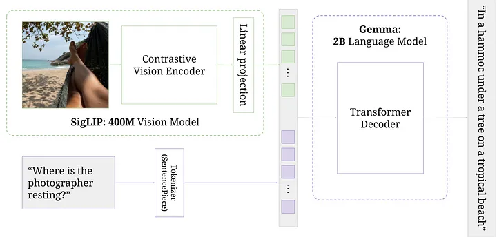

# PaliGemma Vision Language Model

처음 설명할 부분은 Vision Transformer 입니다. 이 파트에서 Contrastive Learning 이 뭔지 배울 것입니다. 그 다음으로 이미지 토큰과 텍스트 토큰을 결합하는 방법에 대해서도 알 수 있습니다. Tokenizer는 따로 코딩을 하지 않을 것입니다.   
왜냐하면 Tokenizer는 따로 세션을 만들어서 진행하는 것이 좋을 것 같아요. Tokenizer에 대해서 다룰 내용이 매우 많기 때문입니다. 

## Contents 

### Contrastive Learning (CLIP, SigLip)

`Contrastive Learning` 은 단순히 이미지를 입력하고 이를 임베딩으로 바꾸는 것입니다. 이미지의 각 픽셀 블록은 고정된 사이즈의 벡터인 임베딩(Embedding)으로 변환되죠. 이 임베딩 토큰들이 이어져서(concat) `Transformer Decoder`로 전달됩니다. 

텍스트 데이터는 Transformer의 Text Encoder를 통해서 임베딩됩니다.
예를 들어서 구글의 이미지와 캡션에 대해서 크롤링을 한다고 하면 각 이미지에 해당하는 텍스트가 함께 저장이 되겠죠? 

이미지는 Vision Transformer에서 배웠던 것처럼 `Image Encoder`를 통해서 임베딩됩니다. 임베딩된 각 항목에 해당하는 텍스트를 가져오는 것이죠. 그러면 이미지 1번과 텍스트 1번이 매칭되는 방식으로 모든 이미지와 텍스트가 구성이 될 것입니다. 이것들을 임베딩 목록으로 인코딩하고 이 모델을 훈련시키고 싶은거죠. 

$I_1$ 과 $T_1$은 내적을 통해서 닮은 정도를 확인. 즉, 얼마나 유사한 의미를 가지고 있는지를 계산하게 되겠죠. 이 둘은 1번 이미지와 1번 텍스트니까 높은 내적 값을 가지게 될거예요. 그런데 $I_4$와 $T_7$은 낮은 값이 생성되어야 하겠죠? 

결국 각 임베딩 요소마다 모든 가능한 조합을 모두 계산하고 손실함수를 통해서 학습을 합니다. $T_1$ 은 텍스트 1번인데, 이와 가능한 조합은 이미지 임베딩 목록에서 $I_1$ , $I_2$ , $I_3$ ... 과 같이 모든 조합에 대한 값을 계산할 수 있죠. 어떻게 되는거죠?
$T_1 * I_1$ , $T_2 * I_2$ ... 이런 식으로 내적값을 계산하게 됩니다.
또한 $I_1$을 기준으로 보면 $I_1 * T_1$ , $I_1 * T_2$ ... 이런 식으로 내적값을 계산할 수 있습니다. 계산을 하면 서로 매칭이 되는 내적값은 더 높아지고 매칭이 되지 않는 값들은 내적값이 더 낮아지겠죠.  (위의 그림에서 대각선의 내적값)

기본적으로 우리는 교차 엔트로피 손실(Cross Entropy Loss)를 통해서 해당 loss를 계산하게 됩니다.

교차 엔트로피를 사용하는 이유는 이해하려면 우리가 어떻게 언어 모델을 훈련시키는지에 대해서 잘 봐야합니다. 

예를 들어서 'I love pepperoni pizza' 라는 문장이 있다면, 이 문장을 어떻게 훈련하죠? 우선 언어 모델에 대한 프롬프트를 제공합니다. 

임베딩은 logits으로 변환되었는데요, logits 이라는 것은 논리의 분포라고 생각하시면 됩니다. 언어 모델은 다음 단어마다 할당된 점수를 보고 가장 높은 점수를 가진 단어 토큰을 선택합니다. 

'I love pepperoni ' 다음의 토큰을 예측해야 하죠 -> LM -> [~~~]

여기서 첫 번째 토큰은 'Hello' , 두 번째 토큰은 'Pizza', 세 번째는 'Car' 이라고 해봅시다. 당연히 우리가 원하는 단어는 'Pizza' 이므로 이에 해당하는 토큰 번호를 원합니다. 단어들이 있는 분포는 softmax를 통과하여 벡터로 분포하게 되는데요, 여기에서 'Pizza'가 있는 부분만 1이되고 나머지는 0이 되도록 훈련을 합니다. 'Pizza'가 높은 점수를 받을 수 있도록 학습되는 것이죠. 

Cross Entropy Loss는 수식으로 다음과 같이 나타납니다. 
$L = -\sum_{i} y_i \log(\hat{y}_i)$

여기서 $y_i$는 실제 라벨(one-hot 벡터), $\hat{y}_i$는 모델의 예측 확률입니다.

이 예시를 통해 확인한 Cross Entropy Loss를  Contrastive Learning에서 그대로 사용할 수 있는 것이죠. 첫 번째 컬럼에서 $T_1 * I_1$은 1이 되고 나머지는 모두 0이 됩니다.  

### Vision Transformer 

### Language Model (Gemma)

### KV - Cache 

### Rotary Positional Encoding 

### Normalization (Batch, Layer, RMS)