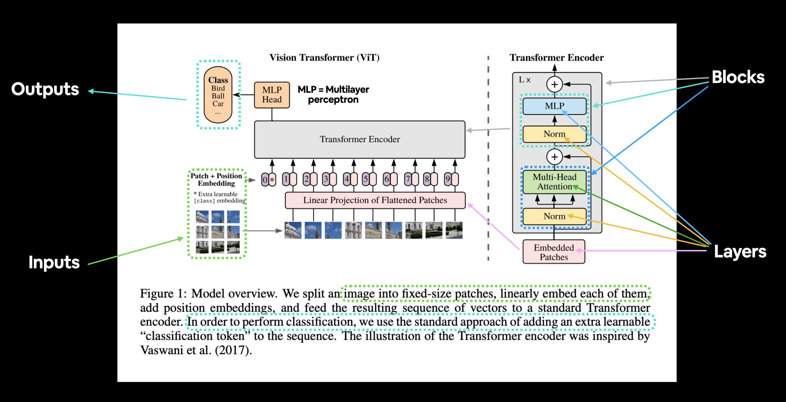

# Vit

## Abstract 

트랜스포머를 이미지 분류에 그대로 적용해봅시다. 
전체 이미지를 패치(patch)로 쪼개면 하나의 이미지를 하나의 문장으로, 패치들은 해당 문장의 단어들로 생각할 수 있습니다.

그래서 논문 제목이 'An Image is worth 16 x 16 words'인 것이죠. 
각 패치가 14x14면 224/14 =16 이라서 그렇습니다. 패치의 픽셀값들을 한 줄로 쭉 편 것이 곧 입력 벡터인 것입니다. 
(NLP처럼 one-hot 벡터가 들어간 것은 아닙니다.)

같은 해상도를 가진 이미지가 들어온다면 pad tokken을 채울 필요도 없고, masked attention도 안 해도 돼서 구현은 오히려 더 쉽습니다. 

이것은 말하자면 patch embedding vector로 볼 수 있겠네요. 

Transformer의 Q,K,V 와 똑같이 패치들이 Q,K,V로 만들어질 것입니다. Q,K로 weight를 만들어서 value vector의 weighted sum으로 패치를 임베딩 한다는 것이죠. 

패치 임베딩 벡터를 전체 패치 임베딩 벡터 간의 weighted sum으로 쇄신해 나간다라고 볼 수 있습니다. 

각 패치를 전체 패치와의 관계를 봐가면서 학습되는 것이죠. 

## CNN

CNN은 구조상 처음엔 좁은 영역을 보고 점차 넓혀가면서 이미지를 인식합니다. 하지만, 이것이 오히려 inductive bias를 만든다는 것입니다. 
반면, vit는 언제와 어디를 볼지 AI 너가 알아내! 라고 하는 것과 같습니다. 
또, vit 역시 LLM처럼 (데이터만 많다면) 모델이 커질수록 성능도 올라간다! 

즉, 데이터가 적으면 inductive bias가 힘을 발휘하지만 데이터가 많을 때는 더 좋아질 수 있는데도 불구하고 CNN이 가지는 선입견 때문에 방해를 받습니다. 

## 전체 구조 , 동작 방식 

BERT와 유사한 전체 구조를 보여줍니다. Encoder만 사용하는 구조이죠. 

1. 패치로 쪼갠다

2. 각 패치를 쭉 펴서 (개단차)로 만들고 `nn.Linear(차,hidden_dim)`를 통과시킨다. (트랜스포머의 input imbedding 작업과 비슷함. 행뽑기가 아니라는 점만 다름. 즉, 모든 패치가 같은 행렬을 통과하는 것)
구현에서는 `nn.Linear(3,dim,14,stride=14)`통과시키고 rearrange 해서 1,2번을 구현

3. 패치의 위치를 알려주기 위해 positional embedding 사용, 패치 임베딩과 더한다. (concat 아님)

4. CLS 토큰 도입, 위치 임베딩과 더해서 넣는다.
    - 위 그림에서는 토큰은 총 10개
    - self-attention 하면서 CLS 토큰에 패치들의 정보가 담긴다. 

5. CLS의 최종 임베딩 벡터를 MLP 통과시켜서 분류 

 